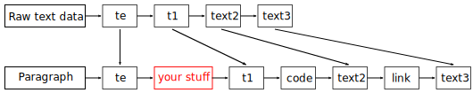

<!--
	SPDX-FileCopyrightText: 2022-2024 Igor Mironchik <igor.mironchik@gmail.com>
	SPDX-License-Identifier: MIT
-->

[](https://opensource.org/licenses/MIT)

`md4qt` is a header-only C++ library for parsing Markdown.

`md4qt` supports CommonMark 0.31.2 Spec, and some GitHub extensions, such as
tables, footnotes, tasks lists, strikethroughs, LaTeX Math injections, GitHub's autolinks.

`md4qt` can be built with Qt6 or with ICU.

This library parses Markdown into tree structure.

> [!IMPORTANT]
>
> Development of `md4qt` moved to https://invent.kde.org/libraries/md4qt

> [!WARNING]
>
> In `md4qt` version `3.0.0` was introduced performance regression, that you can get
> when in your `Markdown` document are a lot of lists. It's already fixed in
> https://invent.kde.org/libraries/md4qt

> [!NOTE]
>
> `md4qt` in https://invent.kde.org/libraries/md4qt is not fully API compatible with
> previous versions, some things (like protected data members) was renamed, extension
> of header files is `*.h`. `md4qt` there is planning to be version `4.0.0`.

* [Example](#example)
* [Benchmark](#benchmark)
* [Playground](#playground)
* [Q/A](#qa)
  * [Why another AST Markdown parser?](#why-another-ast-markdown-parser)
  * [What should I know about links in the document?](#what-should-i-know-about-links-in-the-document)
  * [What is the second argument of `MD::Parser::parse()`?](#what-is-the-second-argument-of-mdparserparse)
  * [What is an `MD::Anchor`?](#what-is-an-mdanchor)
  * [Does the library throw exceptions?](#does-the-library-throw-exceptions)
  * [Why `MD::Parser` and `MD::Document` are templates?](#why-mdparser-and-mddocument-are-templates)
  * [So, how can I use `md4qt` with `Qt6` and `ICU`?](#so-how-can-i-use-md4qt-with-qt6-and-icu)
  * [`ICU` is slower then `Qt6`? Really?](#icu-is-slower-then-qt6-really)
  * [Why is parsing wrong on Windows with `std::ifstream`?](#why-is-parsing-wrong-on-windows-with-stdifstream)
  * [How can I convert `MD::Document` into `HTML`?](#how-can-i-convert-mddocument-into-html)
  * [How can I obtain positions of blocks/elements in `Markdown` file?](#how-can-i-obtain-positions-of-blockselements-in-markdown-file)
  * [How can I easily traverse through the `MD::Document`?](#how-can-i-easily-traverse-through-the-mddocument)
  * [Why don't you have an implementation for pure `STL` with `std::string`?](#why-dont-you-have-an-implementation-for-pure-stl-with-stdstring)
  * [Is it possible to write custom text plugin for this parser?](#is-it-possible-to-write-custom-text-plugin-for-this-parser)
    * [What is a `ID` of a plugin?](#what-is-a-id-of-a-plugin)
    * [What is a `TextPluginFunc< Trait >`?](#what-is-a-textpluginfunc-trait-)
    * [What is `processInLinks` flag for?](#what-is-processinlinks-flag-for)
    * [What for is a `userData` argument?](#what-for-is-a-userdata-argument)
    * [Could you show an example of a plugin?](#could-you-show-an-example-of-a-plugin)
    * [I didn't understand how raw text data correlates with a paragraph.](#i-didnt-understand-how-raw-text-data-correlates-with-a-paragraph)
    * [How can I get a string of `StyleDelim`?](#how-can-i-get-a-string-of-styledelim)
  * [Is it possible to find `Markdown` item by its position?](#is-it-possible-to-find-markdown-item-by-its-position)
  * [How can I walk through the document and find all items of given type?](#how-can-i-walk-through-the-document-and-find-all-items-of-given-type)
  * [How can I add and process a custom (user-defined) item in `MD::Document`?](#how-can-i-add-and-process-a-custom-user-defined-item-in-mddocument)

# Example

```cpp
#define MD4QT_QT_SUPPORT
#include <md4qt/parser.hpp>

int main()
{
    MD::Parser< MD::QStringTrait > p;

    auto doc = p.parse( QStringLiteral( "your_markdown.md" ) );
	
    for( auto it = doc->items().cbegin(), last = doc->items().cend(); it != last; ++it )
    {
        switch( (*it)->type() )
        {
            case MD::ItemType::Anchor :
            {
                auto a = static_cast< MD::Anchor< MD::QStringTrait >* > ( it->get() );
                qDebug() << a->label();
            }
                break;

            default :
                break;
        }
    }

    return 0;
}
```

# Benchmark

Approximate benchmark with [md4c](https://github.com/mity/md4c) and
[cmark-gfm](https://github.com/github/cmark-gfm) says, that Qt6 version of `md4qt` is slower ~8-12 times.
But you will get complete C++ tree structure of the Markdown document with all
major extensions.

| [cmark-gfm](https://github.com/github/cmark-gfm) | [md4c](https://github.com/mity/md4c) | [markdown-it (Rust)](https://github.com/markdown-it-rust/markdown-it) | `md4qt` with `Qt6` |
| --- | --- | --- | --- |
| ~284 microseconds | ~427 microseconds | ~6700 microseconds | ~3394 microseconds |

> [!NOTE]
>
> *This measurement done with test file in [markdown-it (Rust)](https://github.com/markdown-it-rust/markdown-it)*
>
> *`markdown-it (Rust)` measurement done with `markdown_it::plugins::extra`*
>
> **Keep in mind that `markdown-it (Rust)` doesn't support all GFM extensions, so it's not honest
> to compare. `md4qt` supports GitHub's autolinks extension, that `markdown-it (Rust)` doesn't, and
> this requires ~500 microseconds, for example...**

# Playground

You can play in action with `md4qt` in [Markdown Tools](https://github.com/igormironchik/markdown-tools). There you can find `Markdown` editor/viewer/converter to `PDF`.

# Q/A

Why another AST Markdown parser?
---

 * When I wrote this library I knew about `md4c` parser, but not about `cmark-gfm`.
 `md4c` was not suitable for my purposes, whereas `cmark-gfm` could do
 everything I needed. But God did it so, so I wrote `md4qt` and only later
 knew about `cmark-gfm`. Ok, code is written and tested. Let it be.

   What I can say yet, is that this library is C++. And for some people can be
   easier to use C++ code instead of C with freeing memory by hands. Qt do things
   easier by handling text encoding... So let it be, guys.

   And one more cherry on the cake - `md4qt` can parse Markdown recursively.
   What it is described bellow.

What should I know about links in the document?
---

 * In some cases in Markdown link's URL is something document related. So, when
you got a `MD::Link` in the document check if the labeled links of the
document contains key with URL in the link, and if so, use URL from
labeled links, look:

   ```cpp
   MD::Link< MD::QStringTrait > * item = ...;

   QString url = item->url();

   const auto it = doc->labeledLinks().find( url );
   
   if( it != doc->labeledLinks().cend() )
       url = it->second->url();
   ```

What is the second argument of `MD::Parser::parse()`?
---

 * Second argument of `MD::Parser::parse()` is a flag that tells to the
parser to process Markdown files recursively or no. If parsing is recursive
then if in the targeted Markdown file exist links to other Markdown files,
then they will be parsed too and will exist in the resulting document.

What is an `MD::Anchor`?
---

 * As `md4qt` supports recursive Markdown parsing, then in the resulting
document can be represented more then one Markdown file. Each file in the
document starts with `MD::Anchor`, it just shows that during traverse through
the document you reached new file.

Does the library throw exceptions?
---

 * No. This library doesn't use exceptions. Any text is a valid Markdown, so I
don't need to inform user about errors. Qt itself doesn't use exceptions too.
So you can caught only standard C++ exceptions, like `std::bad_alloc`, for
example. Possibly with `MD::UnicodeStringTrait` you will catch more standard
exceptions, possibly I missed something somewhere, but I tried to negotiate
all possible exceptions.

Why `MD::Parser` and `MD::Document` are templates?
---

 * Since version `2.0.0` `md4qt` can be built not only with `Qt6`, but with
`STL` too. The code of the parser is the same in both cases. I just added two
ready traits to support different C++ worlds. With `STL` I use `ICU` library
for Unicode handling, and `uriparser` library to parse and check URLs.
These dependencies can be installed with the Conan package manager.

So, how can I use `md4qt` with `Qt6` and `ICU`?
---

 * To build with `ICU` support you need to define `MD4QT_ICU_STL_SUPPORT`
before including `md4qt/parser.hpp`. In this case you will get access to
`MD::UnicodeStringTrait`, that can be passed to `MD::Parser` as template
parameter. You will receive in dependencies `C++ STL`, `ICU` and
`uriparser`.

   To build with `Qt6` support you need to define `MD4QT_QT_SUPPORT`.
   In this case you will get access to `MD::QStringTrait` to work with
   Qt's classes and functions. In this case in dependencies you will
   receive `Qt6`.
   
   You can define both to have ability to use `md4qt` with `Qt6` and
   `ICU`.

`ICU` is slower then `Qt6`? Really?
---

 * Don't believe anybody, just build built-in `md_benchamrk` and have a
look. Dry numbers says, that `Qt6` `QString` ~2 times faster
`icu::UnicodeString` in such tasks. Markdown parsing implies to check
every symbol, and tied to use access to every character in the string
with `operator [] (...)`, or member `at(...)`. I do it very often in the
parser's code and profiler says that most of the run-time is spent
on such operations. `QString` just more optimized for access separate
character then `icu::UnicodeString`...

Why is parsing wrong on Windows with `std::ifstream`?
---

 * Such problem can occur on Windows with MSVC if you open file in text
mode, so for `MD::Parser` always open `std::ifstream` with `std::ios::binary`
flag. And yes, I expect to receive UTF-8 encoded content...

How can I convert `MD::Document` into `HTML`?
---

 * In version `2.0.5` were made commits with implementation of
`MD::toHtml()` function. You can do the following:

   ```cpp
   #define MD4QT_QT_SUPPORT
   #include <md4qt/traits.hpp>
   #include <md4qt/parser.hpp>
   #include <md4qt/html.hpp>

   int main()
   {
       MD::Parser< MD::QStringTrait > p;

       auto doc = p.parse( QStringLiteral( "your_markdown.md" ) );

       const auto html = MD::toHtml( doc );

       return 0;
   }
   ```

How can I obtain positions of blocks/elements in `Markdown` file?
---

 * Done in version `2.0.5`. Remember that all positions in `md4qt` start with 0,
where first symbol on first line will have coordinates `(0,0)`. One more important thing is
that all ranges of position in `md4qt` are given inclusive, that mean that last column
of any element will point to the last symbol in this element.

## How can I easily traverse through the `MD::Document`?

* Since version `2.6.0` in `md4qt/visitor.hpp` header implemented `MD::Visitor` interface
with which you can easily walk through the document, all you need is implement/override
virtual methods to handle that or another element in the document, like:

  ```cpp
  virtual void onHeading(
     //! Heading.
     Heading< Trait > * h ) = 0;
  ```

## Why don't you have an implementation for pure `STL` with `std::string`?

* Because of performance, I did an pure `STL` implementation where string class
was an `std::string` with some small third-party library to handle `UTF8`, and
benchmark said that the performance was like with `Qt6` `QString`, so I decided
to not support third trait. Maybe because I so lazy?

## Is it possible to write custom text plugin for this parser?

* Since version `3.0.0` in the `MD::Parser` was added a method for adding custom
text plugins.

  ```cpp
  //! Add text plugin.
  void addTextPlugin(
    //! ID of a plugin. Use TextPlugin::UserDefinedPluginID value for start ID.
    int id,
    //! Function of a plugin, that will be invoked to processs raw text.
    TextPluginFunc< Trait > plugin,
    //! Should this plugin be used in parsing of internals of links?
    bool processInLinks,
    //! User data that will be passed to plugin function.
    const typename Trait::StringList & userData );
  ```

### What is a `ID` of a plugin?

* `ID` of a plugin is a regular `int` that should be (but not mandatory) started from

  ```cpp
  enum TextPlugin : int {
    UnknownPluginID = 0,
    GitHubAutoLinkPluginID = 1,
    UserDefinedPluginID = 255
  }; // enum TextPlugin
  ```

  `UserDefinedPluginID` value. Note that plugins will be invoked corresponding
  to its `ID` from smallest to largest, so a developer can handle an order of text
  plugins.

### What is a `TextPluginFunc< Trait >`?

* Text plugin is a usual function with a signature

  ```cpp
  template< class Trait >
  using TextPluginFunc = std::function< void ( std::shared_ptr< Paragraph< Trait > >,
    TextParsingOpts< Trait > &, const typename Trait::StringList & ) >;
  ```

  You will get already parsed `Paragraph` with all items in it. And you are
  able to process remaining raw text data and check it for what you need.

  `TextParsingOpts` is an auxiliary structure with some data. You are interested
  in `bool collectRefLinks;`, when this flag is `true` the parser is in a state of
  collecting reference links, and on this stage plugin may do nothing.

  A last argument of plugin function is a user data, that was passed to 
  `MD::Parser::addTextPlugin()` method.

  A most important thing in `TextParsingOpts` structure is a
  `std::vector< TextData > rawTextData;`. This vector contains not processed raw
  text data from `Markdown`. The size of `rawTextData` is the same as a count of
  `Text` items in `Paragraph`, and theirs sizes should remain equal. So, if you replace
  one of text item with something, for example link, corresponding text item
  should be removed from `Paragraph` and `rawTextData`. Or if you replace just
  a part of text item - it should be modified in `Paragraph` and `rawTextData`.
  Be careful, it's UB, if you will make a mistake here, possibly you will crash.

  One more thing - don't forget to set positions of elements in `Document` to new
  values if you change something, and don't forget about such things like
  `openStyles()` and `closeStyles()` of `ItemWithOpts` items. Document should
  remain correct after your manipulations, so any syntax highlighter, for example,
  won't do a mistake.

  Note, that `TextData` is

  ```cpp
  struct TextData {
    typename Trait::String str;
    long long int pos = -1;
    long long int line = -1;
    bool spaceBefore = false;
    bool spaceAfter = false;
  };
  ```

  And `pos` and `line` here is relative to `MdBlock< Trait > & fr;` member of
  `TextParsingOpts`, but document require absolute positions in the `Markdown`
  text. So when you will set positions to new items, use, for example, a following
  code.

  ```cpp
  setEndColumn( po.fr.data.at( s.line ).first.virginPos( s.pos ) );
  ```

  where `s` is an object of `TextData` type.

### What is `processInLinks` flag for?

* `processInLinks` flag should be set to false if you desire to not process your
plugin in link's captions, as, for example, links can't contain other links, so
if you are implementing a plugin for new links this flag should be set to `false`
for your plugin.

### What for is a `userData` argument?

* This list of strings will be passed to plugin function. This is auxiliary data
that can be handy for plugin implementation.

### Could you show an example of a plugin?

* In `md4qt` already exists one text plugin for handling GitHub's autolink. A
  plugin function is quite simple, look.

  ```cpp
  template< class Trait >
  inline void
  githubAutolinkPlugin( std::shared_ptr< Paragraph< Trait > > p,
    TextParsingOpts< Trait > & po )
  {
    if( !po.collectRefLinks )
    {
      long long int i = 0;

      while( i >= 0 && i < (long long int) po.rawTextData.size() )
      {
        i = processGitHubAutolinkExtension( p, po, i );

        ++i;
      }
    }
  }
  ```

  But `processGitHubAutolinkExtension()` is not so trivial :) Have a look
  at its implementation to have a good example, it's placed in `parser.hpp`.

  Good luck with plugining. :)

### I didn't understand how raw text data correlates with a paragraph.

* Let I will show you on example how raw text data correlate with paragraph. Just two
  diagrams and you won't have anymore questions. Look.

  Consider we want to replace any occurence of `@X` by some kind of a link. Before
  modifications we had.

  

  And after work of your plugin we should have.

  

### How can I get a string of `StyleDelim`?

* Since version `3.0.0` was added a function to get a substring from text fragment with given
virgin positions.

  ```cpp
  template< class Trait >
  inline typename Trait::String
  virginSubstr( const MdBlock< Trait > & fr, const WithPosition & virginPos );
  ```

  And a function to get local position from virgin one.

  ```cpp
  template< class Trait >
  inline std::pair< long long int, long long int >
  localPosFromVirgin( const MdBlock< Trait > & fr,
    long long int virginColumn,
    long long int virginLine )
  ```

## Is it possible to find `Markdown` item by its position?

 * Since version `3.0.0` was added new structure `MD::PosCache`. You can pass
`MD::Document` into its `initialize()` method and find first item with all its
nested first children by given position with `findFirstInCache()` method.

## How can I walk through the document and find all items of given type?

 * Since version `3.0.0` was added algorithm `forEach()`.

   ```cpp
   //! Calls function for each item in the document with the given type.
   template< class Trait >
   inline void
   forEach(
     //! Vector of item's types to be processed.
     const typename Trait::template Vector< ItemType > & types,
     //! Document.
     std::shared_ptr< Document< Trait > > doc,
     //! Functor object.
     ItemFunctor< Trait > func,
     //! Maximun nesting level.
     //! 0 means infinity, 1 - only top level items...
     unsigned int maxNestingLevel = 0 );
   ```

## How can I add and process a custom (user-defined) item in `MD::Document`?

 * Since version `3.0.0` in `MD::ItemType` enum appeared `UserDefined` enumerator.
So you can inherit from any `MD::Item` class and return from `type()` method
value greater or equal `MD::ItemType::UserData`. To handle user-defined types of
items in `MD::Visitor` class now exists method `void onUserDefined( Item< Trait > * item )`.
So you can handle your custom items and do what you need.